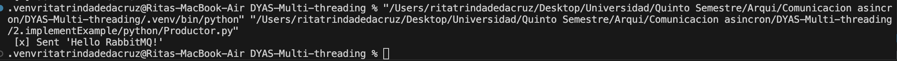
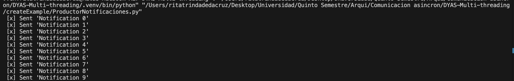

# Taller sobre RabbitMQ

## Objetivo
Aprender a utilizar RabbitMQ para la mensajería asincrónica en aplicaciones con ejemplos prácticos de productores y consumidores en Java y Python.

## Instalación
1. **Instalar RabbitMQ:** Desde [aquí](https://www.rabbitmq.com/download.html).
2. **Verificar ejecución:** Acceder a `http://localhost:15672` o ejecuta `rabbitmq-server` en la terminal.

## Configuración del Proyecto

### Java (pom.xml)
```xml
<dependencies>
    <dependency>
        <groupId>com.rabbitmq</groupId>
        <artifactId>amqp-client</artifactId>
        <version>5.13.1</version>
    </dependency>
</dependencies>
```

### Python (instalar pika)
```bash
pip install pika
```

## Ejemplo de Productor y Consumidor en Python
En esta sección, se implementó los ejemplos de productor y consumidor en Python. El productor envía mensajes a una cola y el consumidor los recibe.

## Crear tu Propio Ejemplo
En esta sección, creé un sistema de notificaciones. El productor envía notificaciones al sistema, y el consumidor las recibe y las procesa.
## Resultados

**Resultado del Ejemplo:**


**Resultado del Sistema de Notificaciones:**

